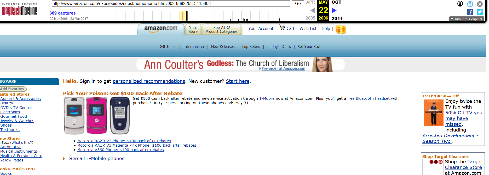

I visited www.amazon.com in 1998
It has changed and improve drastically over the years with way more ads and content. 

The GIT Module is great! At first is was a little confusing but the more I worked with it the easier it became.

  
